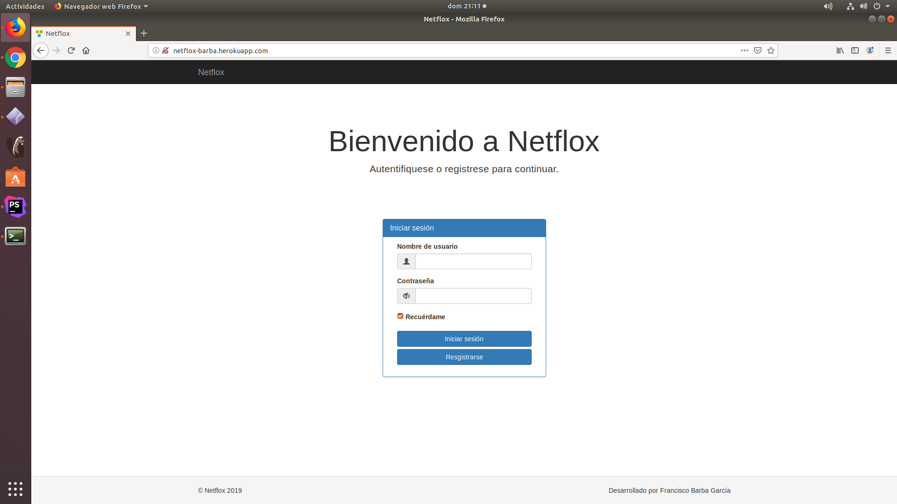
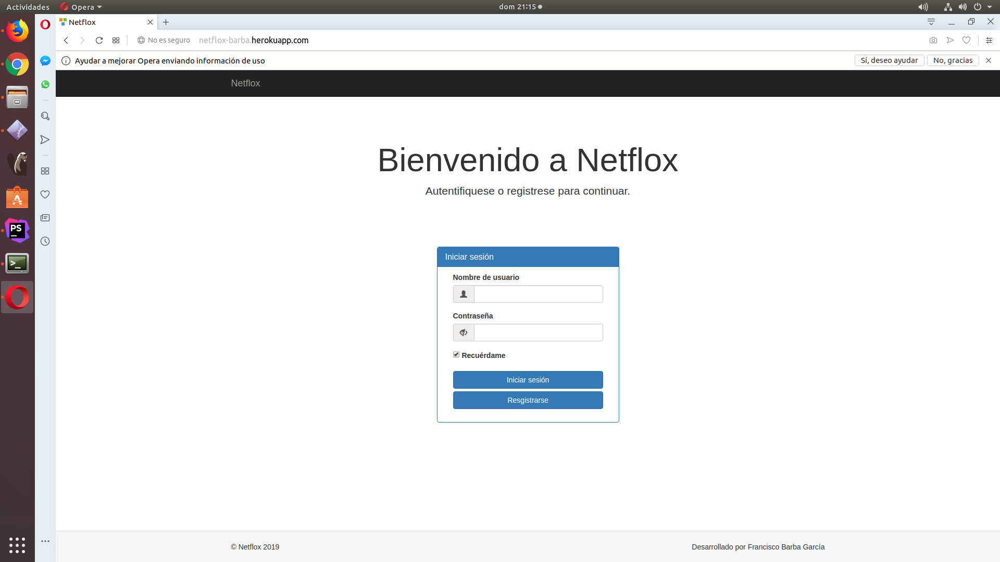
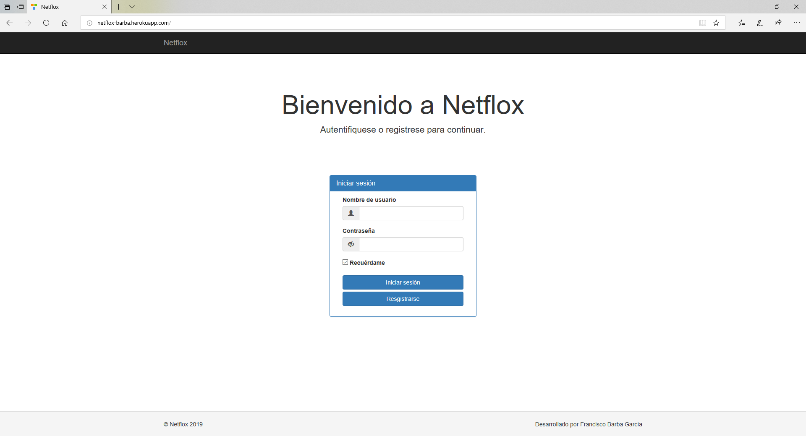
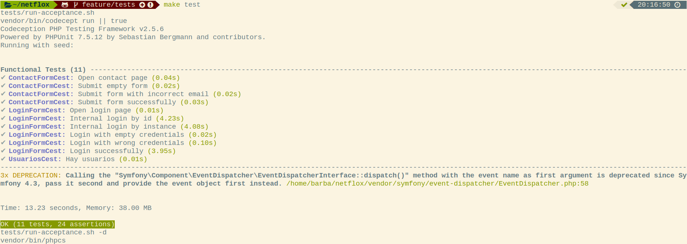

# Anexos

### **([R34](https://github.com/FranBarGar/netflox/issues/34)) Validación HTML5, CSS3 y accesibilidad**
---
### Validación de HTML y CSS

**HTML**

[Enlace a la validación HTML](https://validator.w3.org/nu/?doc=http%3A%2F%2Fnetflox-barba.herokuapp.com%2F)

**CSS**

[Enlace a la validación CSS](https://jigsaw.w3.org/css-validator/validator?uri=http%3A%2F%2Fnetflox-barba.herokuapp.com%2F&profile=css3svg&usermedium=all&warning=1&vextwarning=&lang=es)

---

### Validación de accesibilidad

[Enlace a la validación WCAG](https://achecker.ca/checker/)

La página index cumple el nivel AA de accesibilidad, el error que presenta es por usar una etiqueta h1 dentro de un *Jumbotron* de `Bootstrap`, ya que reconoce los estilos del propio div como si fuera un h1.

---

### Prueba del seis

 1. ¿Qué sitio es éste?
- La aplicación tiene en todo momento elementos indicativos de que sitio es. Arriba en la menú de navegación está en todo momento el logotipo de la aplicación. Abajo en el pié de página, esta también el nombre de la web. El menú de navegación y el pié de página se mantienen siempre, por lo que siempre está identificado el sitio.

 2. ¿En qué página estoy?
- Todas las páginas del sitio están identificadas por las migas de pan (excepto la inicial), lo que te sitúan en todo momento.

 3. ¿Cuales son las principales secciones del sitio?
- Las principales secciones del sitio son *Shows*, *Peliculas*, *Series*, *Social* y *Mi perfil* (solo serán visibles si estamos logueados en la aplicación).

 4. ¿Qué opciones tengo en este nivel?
- Dentro de las secciones *Shows*, *Peliculas* y *Series* tienes para elegir en forma de menu desplegable las formas de ordenacion mas comunes. En *Social* tienes 2 opciones a elegir, *Valoraciones* y *Usuarios*.

 5. ¿Dónde estoy en el esquema de las cosas?
- En todas las páginas existe en la zona superior un indicador de bloque con las migas de pan.

 6. ¿Cómo busco algo?
- Cada seccion tiene su buscador especifico, excepto *Mi perfil*.

---

### **([R36](https://github.com/FranBarGar/netflox/issues/36)) Varios navegadores**

#### **Google Chrome**

---

#### **Mozilla Firefox**

---

#### **Opera**

---

#### **Microsoft Edge**

---

### **([R25](https://github.com/FranBarGar/netflox/issues/25)) Codeception**

---

### **(RXX)) Tecnologias usadas**

- VirtualBox para iniciar el SO Ubuntu
- Ubuntu 18.0.4 como sistema operativo
- Heroku como alojamiento cloud
- Yii2 como framework
- GIT, GITHUB y GIT-FLOW para el control de versiones
- Git-Kraken como asistente grafico a GIT-FLOW
- PhpStorm como IDE
- Google Chrome como navegador principal
- Dbeaver como interfaz grafico SQL
- Umlet como editor de diagramas
- Codeception para las pruebas unitarias
- AWS S3 como almacenamiento cloud de archivos

---