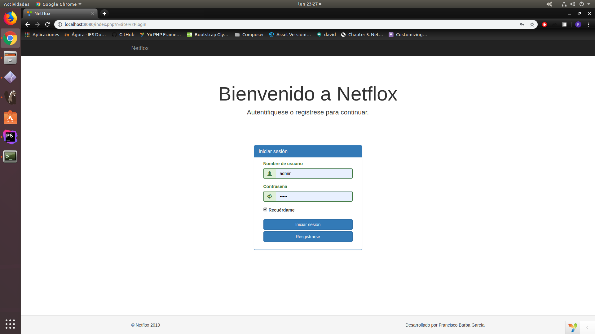
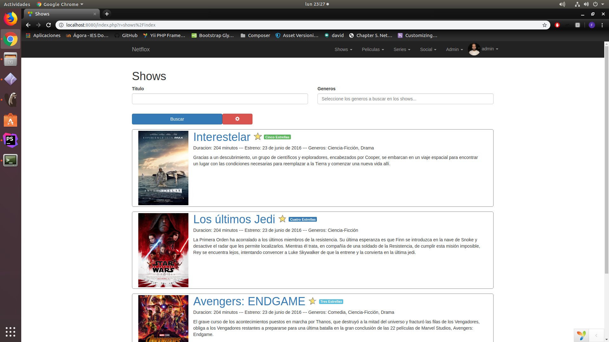
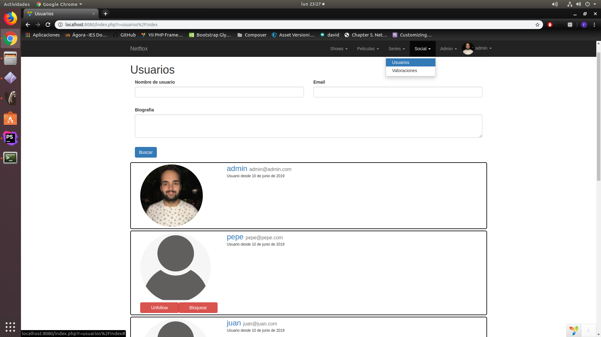
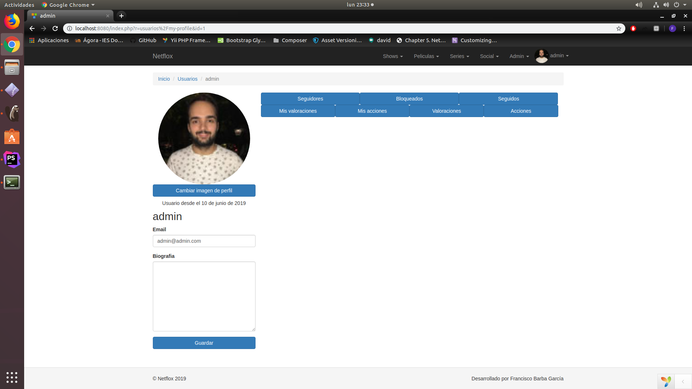
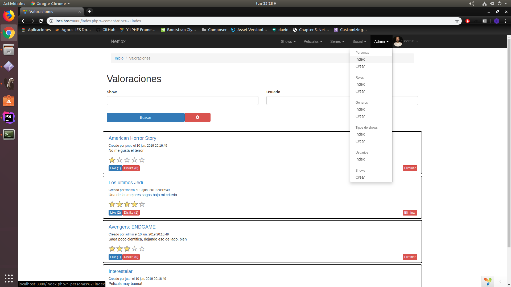
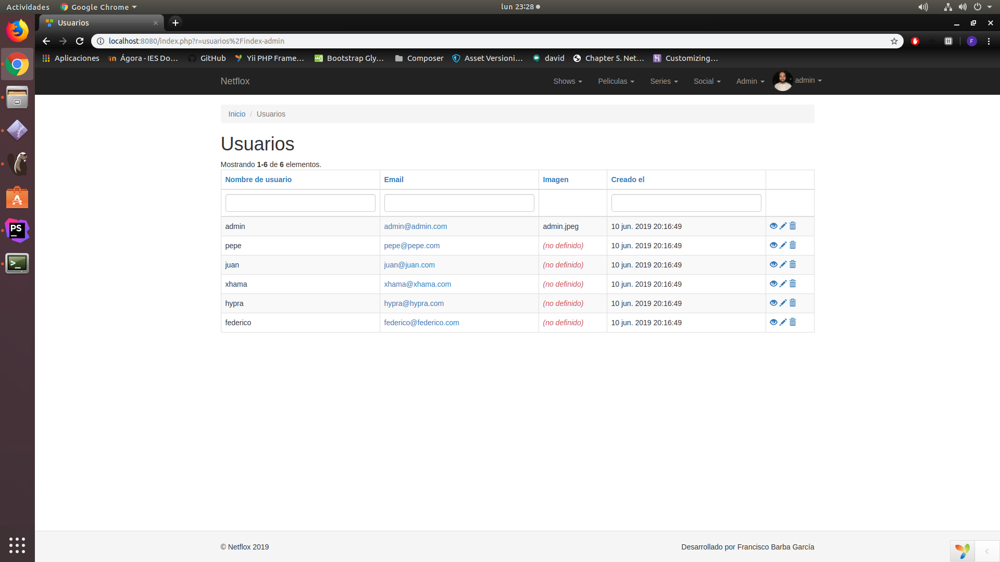
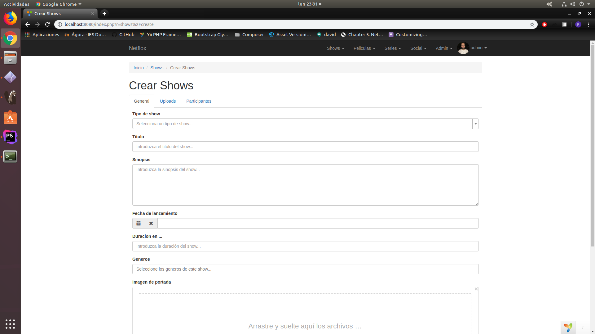

# Manual de usuario

### Página de inicio sin loguearse

Página de inicio antes de loguearnos. No podremos acceder a ninguna otra pagina, tenemos un formulario para hacer ***Login*** o ***Registrarse*** en caso de que aún no lo estemos.

---

### Página de inicio

En esta página podemos encontrar todos los shows y todas las opciones en la barra de menú superior. Entre ellas se encuentran: ***Shows***, ***Peliculas***, ***Series***, ***Social***, ***Admin***(En caso de serlo) y ***Mi perfil***.

---

### Busqueda

Todas las paginas tienen un menu de busqueda, en este caso el menu es desplegable, dejando solo a la vista lo imprescindible.

A continuación explicaremos las diferentes opciones disponibles en el menú superior.

---

### DropDown con ordenacion tipica

Tanto ***Shows***, como ***Peliculas*** y ***Series*** poseen en un menu desplegable las opciones mas tipicas de busqueda para facilitar la navegacion.

---

### Pagina de un show

En esta página, como usuarios podemos valorar, comentar valoraciones, votar tanto valoraciones como comentarios y borrar las valoraciones/comentarios del propio usuario, asi como realizar una accion listada en el glosario.

Como administrador, se puede realizar las mismas acciones que en el parrafo anterior, solo que puedes eliminar cualquier valoracion/comentario a gusto.

En la parte izquierda tenemos la imagen con las opciones posibles a realizar sobre el show. Como administrador nos apareceran botones para ***Editar*** o ***Eliminar*** dicho show.

En la parte central aparecerá la informacion sobre el show, asi como los enlaces de descarga y los comentarios.

---

### Página de Valoraciones

En esta página podemos encontrar las valoraciones de todos los usuarios, con los botones de like y dislike tipicos y un link al show que se valora.

---

### Página de Usuarios

En esta página podemos encontrar a los usuarios de la aplicacion, teniendo varias opciones que podremos ejecutar sobre ellos como usuarios, tales como ***Follow***, ***Unfollow***, ***Bloquear*** y ***Desbloquear***.

Los usuarios que nos tengan bloqueados apareceran con informacion reducida.

---

### Página de Usuario Personal

En esta página podemos encontraremos a un usuario de la aplicacion, siempre y cuando no nos tenga bloqueado. Tenemos varias opciones que podremos ejecutar sobre ellos como usuarios, tales como ***Follow***, ***Unfollow***, ***Bloquear*** y ***Desbloquear***.

Podremos tambien visualizar las ***Acciones*** realizadas por dicho usuario a los diferentes shows de la aplicacion, sus ***Valoraciones***, asi como sus ***Seguidores*** y a las personas a las que esta ***Siguiendo***

---

### Página de Usuario Bloqueado

Esta página será mostrada cuando entremos al perfil de un usuario de la aplicacion que nos tiene bloqueado. Tenemos varias opciones que podremos ejecutar sobre ellos como usuarios, en este caso solo ***Bloquear*** y ***Desbloquear***.

---

### Página de Mi Perfil

Aquí encontramos nuestra informacion personal, pudiendo modificarla a placer.

Podremos tambien visualizar las ***Acciones*** realizadas por el usuario a los diferentes shows de la aplicacion, sus ***Valoraciones***, asi como sus ***Seguidores*** y a las personas a las que esta ***Siguiendo***

Tambien podremos ver las ***Acciones*** y ***Valoraciones*** de las personas a las que estamos ***Siguiendo***, asi como a las personas que estamos bloqueando.

---

### DropDown de Opciones de Admin

En este desplegable encontraremos los CRUD de las diferentes entidades de la aplicacion.

---

### Página de Creacion de Shows

En esta pagina encontraremos diferentes pestañas a rellenar para completar el formulario del show.

---
